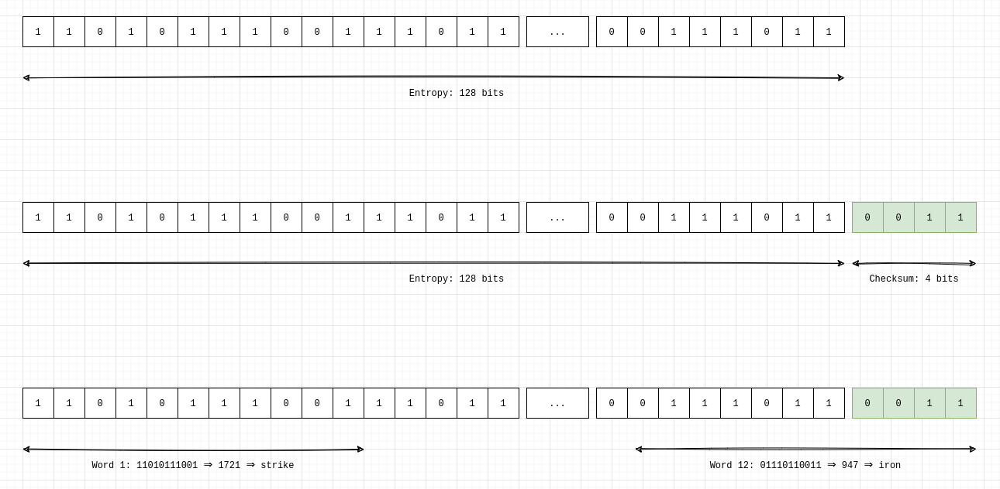

BIP39 is a rather small BIP (the markdown file is only 177 lines!) and yet it touches such a big part of our experience with bitcoin in real life; the creating and handling of the mnemonic phrases. This article explores the BIP in all its gory details.

BIP39 describes the process that connects two things:
1. the 12 or 24 words we commonly use as mnemonics for bitcoin wallets;
2. the seed (a 512-bit number) that serves as the root point for creating the tree-like structure described in BIP32.

## The 4 steps of BIP39
BIP39 outlines a process that can be broken down into 4 parts:
1. Generate entropy (randomness), often 128 or 256 bits of it;
2. Concatenate to that entropy a checksum, so that the total number of bits is divisible by 11;
3. Break the resulting structure into pieces of 11 bits. Match each piece to a word in a wordlist;
4. Transform the mnemonic into a 512-bit seed.

Let's dive into each step into more details.

## Step 1: Generate Entropy
This step is performed by the device that is creating your wallet. It consists of generating a random string of bits that is between 128 and 256 bits long and is a multiple of 32. The most common ones are 128 (which lead to 12-words mnemonic phrases) and 256 (which lead to 24-words mnemonic phrases). This step is typically performed by the random number generator on your device, but there are ways to generate that entropy yourself as well (for example by rolling dice).

## Step 2: Checksum
This step is built in to help mitigate errors when entering mnemonic phrases. It consists of adding a checksum to the string of entropy previously chosen.

The way this is performed is by hashing (SHA256) the bits chosen in step 1 and taking the last part of the resulting hash and concatenating it with the entropy. Because the hashing is deterministic, a chosen entropy will always result in the same hash. Using the last few bits of that hash adds an extra layer of checking for the software before accepting the mnemonic as valid; changing even one of the initial bits will result in a completely different hash output. This makes it likely that the last bits used would then not match, and the error would be detected by the wallet parsing the mnemonic.

The length of the checksum is determined by the initial entropy length. As we'll see in step 3, we need to divide our final string of bits into pieces of 11 bits. This implies that the length of the `entropy + checksum` has to be a multiple of 11. Take for example an initial entropy of 128 bits: we add 4 bits of checksum to the entropy to end up with a 132 bit seed, which gives us 12 even blocks of 11 bits. In the case of 256 bits of initial entropy, we add 8 bits of checksum for a total string of 264 bits, which breaks into 24 neat blocks of 11 bits. 

## Step 3: Break our result in pieces of 11 bits
The next part is easy. We take our resulting string of bits and break it into blocks of 11 bits, and match the resulting blocks of bits with words in a wordlist. There can be multiple such lists, but the ubiquitous one has English words and can be seen [here](#). The bits are read as integer numbers and map to the ranks of the words on the list, e.g. the bits `00000000000` (the number 0) map to the word `abandon` and the bits `11111111111` (the number 2047) map to the word `zoo`.

  <figure style="max-width: 600px; margin: 3rem 0;">
    <!-- 
BIPs
 -->
    

        
    

    

  </figure>

## Step 4: Transform the mnemonic into a 512-bit seed
We now have a way to deterministically recreate that initial entropy (providing the word to software that understands how to map those back to an entropy + checksum string of bits). But this string of bits is not actually what our wallets will use as the "seed" for generating addresses.

That last part requires cycling this string of bits into a hashing function (HMAC-SHA512) 2048 times. This hashing function has the important characteristic of taking two inputs: our initial entropy + checksum, and a second part called the _salt_ (another string of bits). Providing a different value for the salt will generate a different final seed (the result of the hasing 2048 times). This salt is what allows us to choose a passphrase (you'll hear it referred to as "the 25th word" sometimes) to add to our 12 or 24 words, and the reason why providing a different passphrase will always result in a different seed, even given the same set of initial words.
