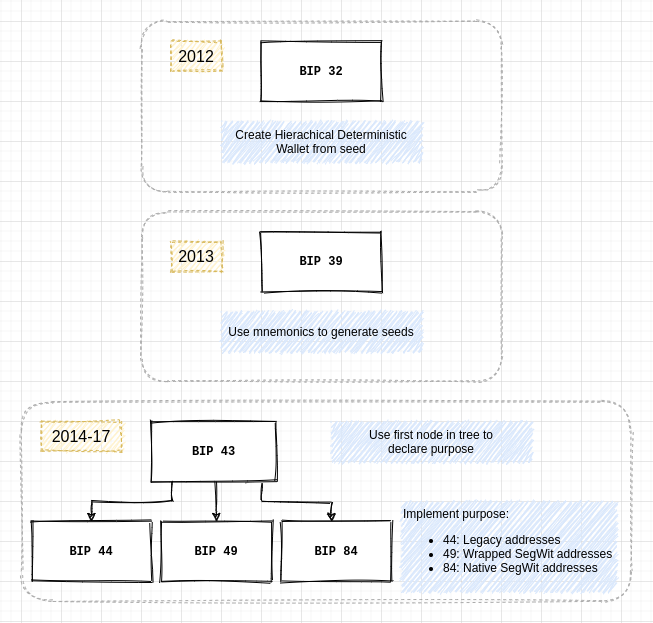
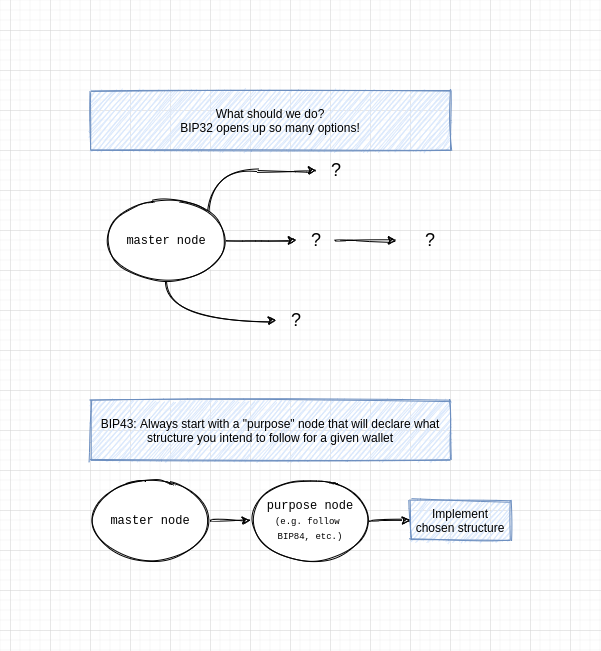
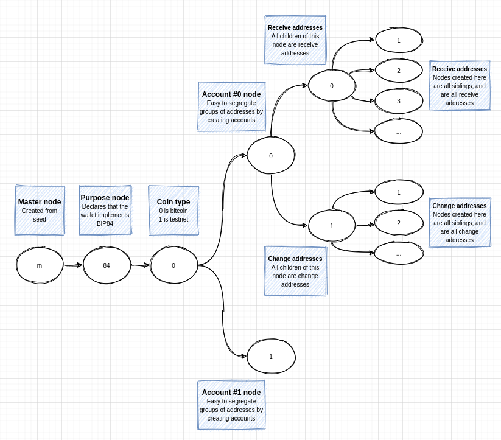

This article describes the family of BIPs that come together to create the modern bitcoin wallet experience. If you've played around with popular wallets like _Samourai_, _Blockstream Green_, _BlueWallet_, _Trezor_, or _Coldcard_, you're probably familiar with phrases like "BIP49/84 compatible", and "BIP39 mnemonic phrase". This article is written for the curious bitcoiner who's interested in making sense of all the BIP numbers thrown around whenever we speak of bitcoin wallets, derivation paths, seeds, and mnemonics. 

Understanding how these BIPs come together at a high level allows us to separate our study of the pieces that make wallets work and interoperate. Let's get to it.

## The 6 BIPs

The typical experience of using wallets like the ones described above can be thought of as relying on a family of 6 BIPs. Of course, all BIPs are connected in some sense, but those 6 form a special group when it comes to modern HD wallet implementations. They are: BIP 32, 39, 43, 44, 49, and 84. We'll dive into each one in more detail below, but let's first understand how they connect to each other:

  <figure style="max-width: 600px; margin: 3rem 0;">
    
The Big 6

    

        
    

    
All 6 BIPs that shape modern HD wallet behaviour.

  </figure>

The diagram above allows us to conceptualize how the BIPs were proposed over time.

If you're not very familiar with BIPs, it's important to understand that none of those are "binding" in any way. There are thousands of ways one could derive a private/public key pair. You certainly don't have to use this set of BIPs to derive yours. On the other hand, the near-infinite ways wallet developers can use to create keys can be problematic.

As a developer, which one should you choose? How can users have good experiences across wallets if everyone implements their own version of wallet key generation? If you create a wallet using Trezor, are you sure that it will work if you try to import it in Samourai? In general, a common set of agreed standards has proven useful, and the 6 BIPs explored here are that common set of standards.

> Here, keeners will note that not all kinks have been solved yet, as amply demonstrated in [walletsrecovery.org](https://walletsrecovery.org/), but for the purposes of this article, we'll assume that in general, abiding by the set of 6 BIPs in the diagram above enables more or less a compatibility across wallets that is desirable and beneficial to users.  

Let's take each BIP in turn and look at what it brought to the table at the time it was proposed, and why the 6 together are used by most of the wallets we know and use today.

## BIP32

[BIP32](https://github.com/bitcoin/bips/blob/master/bip-0032.mediawiki) was authored by Pieter Wuille and proposed in 2012. This is the BIP that lays the foundation for HD (Hierarchical Deterministic) wallets. It outlines how an infinite number of private/public key pairs can be deterministically generated from a single starting "seed", and proposes a procedure to derive those.

> Before BIP32, the standard wallet behaviour was the one implemented in bitcoin core, which was just randomly generating keys, with nothing to tie them together. You had to really save the whole set of private keys on hardware, and hardware failure is common.

BIP32 allows you to save a single number (the seed), and later on recreate deterministically all addresses that are derived from that seed. It also outlines how to build a "tree" of addresses in which the branches can be segregated, as opposed to a single chain of addresses. 

It does not, however, prescribe what to do with this "tree" of addresses. It simply outlines how to create it. If you are thinking that this is rather vague, you'd be right. But BIPs are modular like that; BIP32 outlines how to create the tree, other BIPs propose ways to use that tree-like structure.

The core idea behind BIP32 is the defining of how one can go about creating new "nodes" deterministically in a tree-like structure. Each node can create an infinite number of "children" nodes (called siblings), and each of those siblings can in turn do the same. 

## BIP39

[BIP39](https://github.com/bitcoin/bips/blob/master/bip-0039.mediawiki) addresses the question of the "seed" from BIP32. Notice that BIP32 doesn't prescribe how you should arrive at that seed; it only tells you that you'll need one in order to generate the wallet tree. 

A seed is just a integer (often an unfathomably large integer, but just a integer still). Easy right? But by design, the seed is the one door your need to get in to storm the whole castle (see BIP32). This makes it useful for users because they don't need to backup every single key pair in their wallet—all they need is to back up the one seed. But this feature also makes it attractive for attackers. Find the seed to someone's wallet and you can steal all sats within it. This is why seeds are so important, and why keeping them safe is a paramount objective.

As per BIP32, we now have a need to (1) create a random number, (2) keep it safe from attackers, and (3) not loose it! When it comes to 2 and 3, it's easy to imagine how those don't play well with each other. If you just try to remember an insanely big number (say 1972987237497294279872989872934...09823944239872349872347), you're likely to end up messing it up. You might want to write it down... but then again you're running the risk of making a typo. Another option is to keep it in a hardware backup, say a usb stick. Then again, we don't like to trust hardware too much. This conundrum is not unique to bitcoin, and is the one that BIP39 tried to grapple with.

BIP39 proposes a way to map a number (here your seed) onto a set of predefined words ([2048](https://github.com/bitcoin/bips/blob/master/bip-0039/english.txt) in total). There is a bit more to it (we won't go into checksums in this article), but the basic idea of BIP39 is the following:  

_A given set of words (often 12 or 24) will always allow you to recreate a given seed._  

That's it. It's a 1-to-1 relationship. Your words are your seed, and your seed is your words. You don't need computer hardware to back up your seed, you don't need to learn a long number by heart. All you need is to write down and keep safe (or if you're brave just remember!) a set of 12 words. 

## BIP43

[BIP43](https://github.com/bitcoin/bips/blob/master/bip-0043.mediawiki)'s goal is to refine the idea of the tree-like structure enabled by BIP32. It points out that because BIP32 is non-presciptive, it's hard for wallets to know what sort of tree-like stucture is implemented given a seed. BIP43 suggests to use the first derived child node from the master node as a sort of declaration of what the following wallet implements (BIP43 calls it declaring a purpose). 

  <figure style="max-width: 600px; margin: 3rem 0;">
    <!-- 
BIPs
 -->
    

        
    

    

  </figure>

To see why this is useful, imagine you have a seed, and wish to reload your addresses and funds into a mobile wallet. Unless you can explain to your wallet how exactly the initial creator of your wallet has made use of the tree-like structure descibed in BIP32, it won't really know where to start its scan to search for possible addresses with funds. remember that the tree can be of infinite size; unless you know where to look, you'll be looking for a long time.

With BIP43, the first thing that the wallet can do is search in any of the "purpose" fields it knows about and see if you have transactions in there. For example, a wallet might want to try and see if you have used bech32 addresses, which would all be derived using the BIP84 structure, and would therefore be initiated here in the tree: `m'/84'/...` a quick scan of this side of the tree will either reveal something or nothing at all. If not, your wallet might try to look to see if you have transactions done with wrapped SegWit addresses, in which case it probably would have implemented BIP49. A scan of `m'/49'/...` will either reveal something or nothing. The wallet can keep moving through the set of purposes it supports, or come back empty and declare that the seed is not associated with any known transactions/addresses it knows about. BIP43 simply gives the wallet a place to start looking, and easy ways for other BIPs come up and offer different implementations of wallet structures under different purpose numbers.

## BIP44

[BIP44](https://github.com/bitcoin/bips/blob/master/bip-0044.mediawiki) is a specification for how to derive a set of accounts for legacy bitcoin addresses, and from those a set of addresses. Within each account, it creates a node that will spawn a set of addresses meant as external "recieve" addresses and a set meant for "change" addresses.

  <figure style="max-width: 600px; margin: 3rem 0;">
    <!-- 
BIPs
 -->
    

        
    

    

  </figure>

BIP44 also specifies that the first child node of the purpose node should be reserved for identifying the coin type for the wallet. For example, a mainnet bitcoin wallet will use the 0th node there to signify that its addresses are meant for mainnet. A testnet bitcoin wallet would use 1. Other coins that shall not be named on this blog have claimed other numbers.

## BIP49

[BIP49](https://github.com/bitcoin/bips/blob/master/bip-0049.mediawiki) is similar to BIP44 in the sense that it proposes the use of a similar stucture but for wrapped SegWit addresses. This is a neat way to separate the two, and ensure that a wallet knows what it's looking for when deriving the tree of accounts and addresses. If your wallet finds something under the `m'/49'/...` section of the tree, it knows by design that all addresses in that branch are wrapped SegWit addresses.

BIP49 proposes to use its number as the declaration in the purpose field, indicating that addresses under that branch of the tree will abide by the BIP49 standard and reassuring the wallet that it knows how and where to find associated addresses for the user.

## BIP84

[BIP84](https://github.com/bitcoin/bips/blob/master/bip-0084.mediawiki) is the third one in the family. Its objective is similar to 44 and 49; declare to the wallet that all addresses under it are of a given type (bech32, i.e. native SegWit addresses) and are located in the places specified by the BIP.
