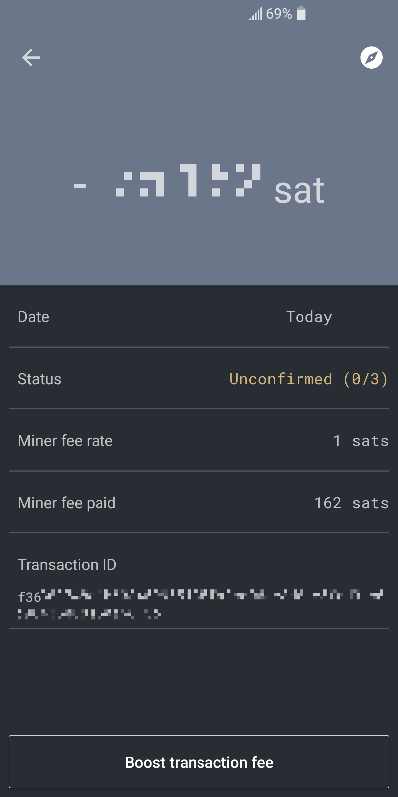
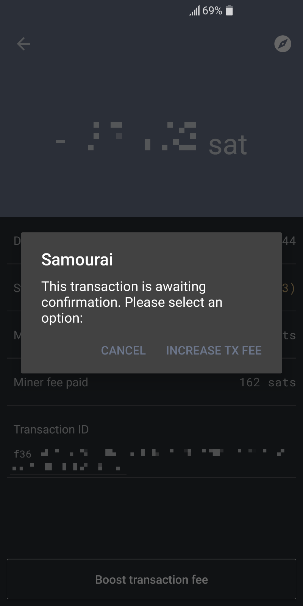
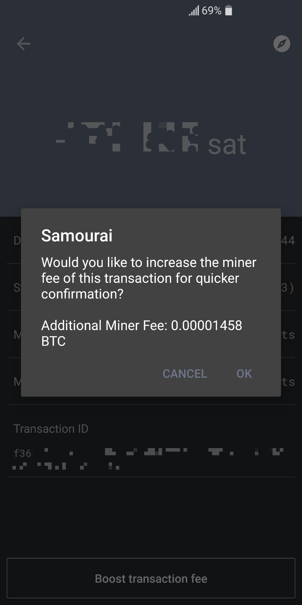

Replace-by-Fee (RBF) is a concept by which a wallet can broadcast a transaction that aims to _overwrite_ a previously broadcasted but unconfirmed transaction sitting in the mempool, most often in order to boost the mining fee and expediate the mining of the transaction. 

> **Know your Samourai** is a series of articles diving head first into Samourai, a bitcoin wallet focused on privacy. The articles are aimed at chewing through one by one the set of features the wallet offers from a curious user perspective. We do things like following UTXOs through a Ricochet transaction, for example, in order to gain deep intuition as to what is happening every time we use the wallet. Check out the [introduction article](#) for an overview of the series' goals and the tools recommended to get the most out of it.

This RBF ability is useful because it allows a user to broadcast a transaction with very little mining fee (say this user is not in a hurry to see the payment go through), and then later on change their mind and "bump" up their fee in order to hasten the mining of the transaction. 

The feature has potential implications for the continuing development of a well liquid fee market, as participants can in theory "lowball" their fees and later on bump them up as needed, leading to better price discovery for fees. It is a fairly used feature—about [10% of transactions signal as _Opt-in-RBF_ enabled](https://transactionfee.info/charts/transactions-signaling-explicit-rbf/) (the variant this article will focus on)—and it is likely to continue being used in the future as block space becomes more and more compteted for.

## Network Level

We should note that there are in fact [4 RBF variants](https://en.bitcoin.it/wiki/Replace_by_fee), and that the choice of which variant(s) to accept and retransmit is decided at the node level (this is referred to as a _node policy_). This article will focus on the most popular of the 4 variants—the one implemented by Samourai—called _Opt-in RBF_. It is described in [BIP125](https://github.com/bitcoin/bips/blob/master/bip-0125.mediawiki) which was authored by [Peter Todd](https://twitter.com/peterktodd) and [David Harding](https://twitter.com/hrdng).

Here is how it happens at the network level: when a node receives a transaction that spends a given set of UTXOs and verifies it as valid, it broadcasts it to its peers and includes it in its mempool. If a new transaction that spends some or all of the same UTXOs is recieved, a prudent way to approach the situation would be to not accept and retransmit the new transaction. The reason for this is that it could lead to DoS attacks—imagine your node being flooded with transactions that all spend the same utxo, meaning only one of those can ultimately be valid, but having to broadcast all of those to your peers. Such an attack would barely cost anything to perform but could potentially jam a whole lot of nodes. Instead, most nodes will reject new "overridding" transactions broadcasted to them, _except_ under very specific circumstances; the transaction has to fall under one of the 4 variants of RBF as described in the [RBF Wiki](https://en.bitcoin.it/wiki/Replace_by_fee).

Nowadays the most prevalent type of RBF is the _Opt-in RBF_ variant, where a transaction can signal that it is ok with being replaced by a new transaction. It does not increase transaction size.

## Samourai UX

You can use RBF in your Samourai wallet by navigating to and selecting the RBF checkbox under `Settings > Transactions > Spend using RBF`. All future transactions you make will be signalling as being Opt-in RBF, and nodes will therefore allow you to send overwriting transactions if you need to bump your fees. Most block explorers will have a flag that will tell you a transaction is RBF signalling.

<section style="display: flex; flex-wrap: wrap; justify-content: space-between;">
  

    <figure style="max-width: 200px; margin: 3rem 0;">
    
Transaction Screen

    
    
The <em>Boost transaction fee</em> button is at the bottom of the Transaction Screen.

  </figure>
  

  

    <figure style="max-width: 200px; margin: 3rem 0;">
    
&nbsp;

    
    
Upon pressing the <em>Boost transaction fee</em> button, you'll be promped for a choice of boost (RBF or Child-Pays-For-Parent).

  </figure>
  

  

    <figure style="max-width: 200px; margin: 3rem 0;">
      
&nbsp;

      
      
The wallet will ask you to confirm that you indeed wish to increase the miner fee using RBF.

    </figure>
  

</section>

To use the feature on an RBF-enabled transaction, go to the transaction screen and press the _Boost transaction fee_ button at the bottom. You'll be prompted with a choice of the way you'd like to boost that fee, and then a screen confirming that you'd like to increase the fee from your current amount to a given extra amount—the proposed new fee will be Samourai's high fee rate at the time of bumping, and is not adjustable. Click _confirm_ and a new transaction will be signed and broadcasted with the new fee taken from the change address if possible, or from another utxo under your wallet's control otherwise.

This will create a new transaction hash (txid), and most nodes will readily accept the new transaction and replace the old one. Note that Samourai's implementation does not allow a rewrite of the outputs: the output addresses have to stay the same as the initial broadcasted transaction.
