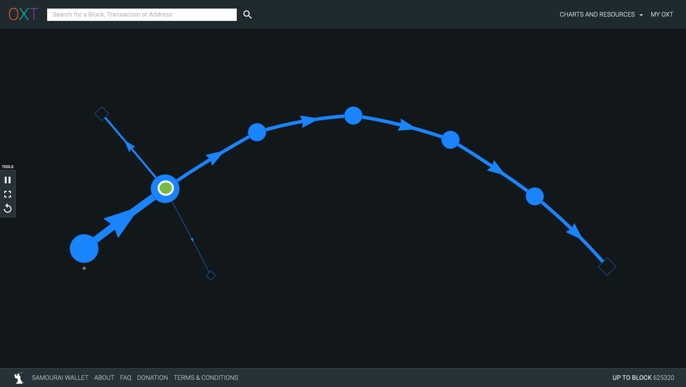
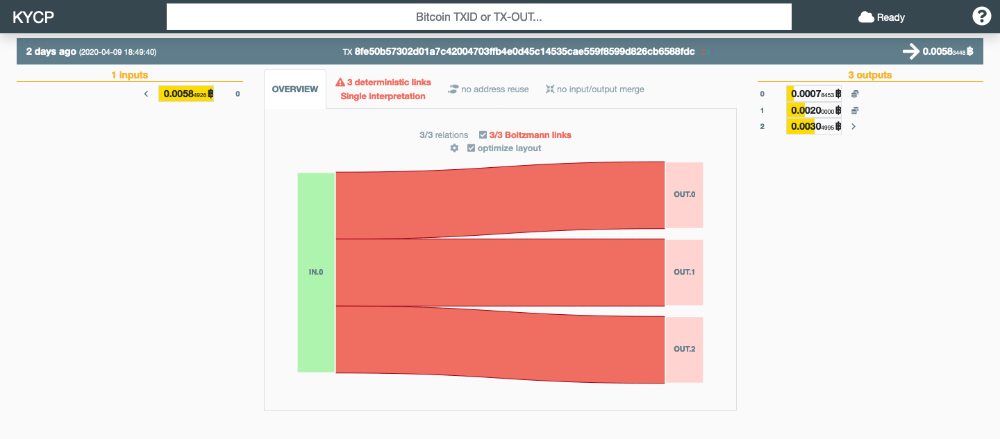
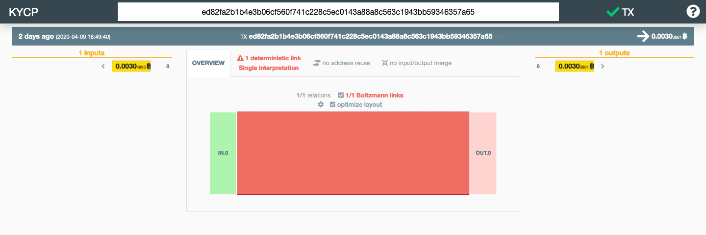
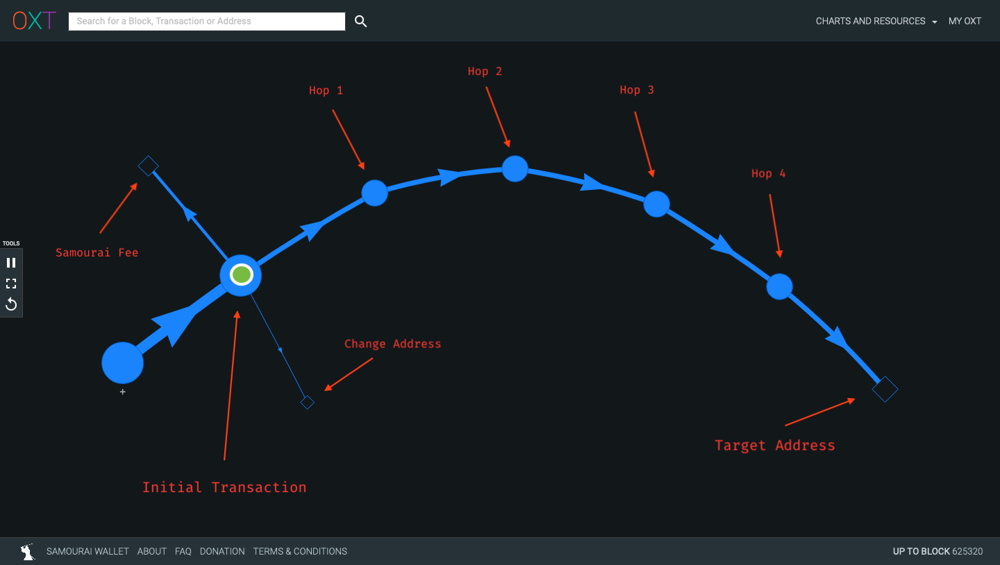
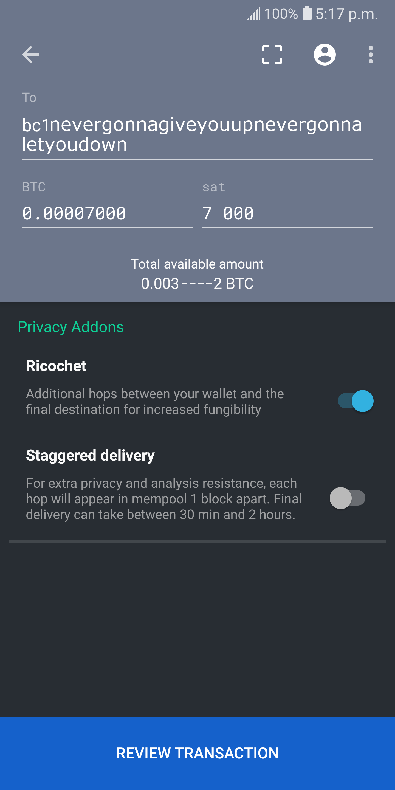

Ricochet is a feature that allows users to put a form of "distance" between two UTXOs. It is a simple procedure, developed to respond to a type of equally simple heuristic that is sometimes used by chain analysis tools.

<center>
  <figure style="max-width: 600px; margin: 3rem 0;">
    <p style="font-family: 'Fira Code', monospace; font-size: 16px; font-weight: 600;">Ricochet Visualization<p>
    
    <p style="font-family: 'Fira Code', monospace; font-size: 11px; line-height: 20px; text-align: left !important;">The payor (blue and green circle on the left) and the payee (small square far right) are separated by 4 extra transactions than they otherwise would be under a direct payment.<p>
  </figure>
</center>

> **Know your Samourai** is a series of articles diving head first into Samourai, a bitcoin wallet focused on privacy. The articles are aimed at chewing through one by one the set of features the wallet offers from a curious user perspective. We do things like following UTXOs through a Ricochet transaction, for example, in order to gain deep intuition as to what is happening every time we use the wallet. Check out the [introduction article](#) for an overview of the series' goals and the tools recommended to get the most out of it.

An example of where a ricochet transaction might be useful is where certain exchanges have been known to refuse payments made with UTXOs that had proximity to coinjoins. The term _proximity_ here is meant to be interpreted as "the number of transactions done between the payment transaction and the coinjoin transaction". Because going back into UTXO histories is computationally costly, chain analysis tools only go so far back. The goal of ricochet is to put just a few more transactions between the payor and the payee than would be investigated by most chain analysis tools.

Take for example the situation where a chain analysis tool would flag a payment as being troublesome if it was 1 step removed from a known address it considered tainted for whatever reason. If you had recieved payment from that address and send that UTXO to an exchange, the chain analysis tool they use would (1) ensure your UTXO is not tainted, and (2) look at the UTXO _it came from_ and see if that UTXO is tainted. In this case it would be, and your payment would be flagged as non valid.

```md
tainted_utxo -> your_utxo -> exchange
```

The number of transactions chain analysis tools might look into can change, but again, going back into every UTXO history is resource intensive, and the furthest you go the more it is; understanding this, samourai plays on that weakness and allows you to simply send your payment from one address to another a few times in a row, in effect creating hops between your initial utxo and the one that the final payee (in this example the exchange) will recieve.

```md
tainted_utxo -> your_utxo -> hop1 -> hop2 -> hop3 -> hop4 -> exchange
```

Now a chain analysis tool going back only, say, 3 hops, will not find anything tainted about any of the utxos on the chain leading up to the payment.

## Ricochet in Practice

Let us follow a whole ricochet set of transactions (should we call them _ricochets_?) from top to bottom using blockchain exploration tools. Note that all 
  <a href="#" class="bitcoin-block" target="_blank">&nbsp; blocks &nbsp;</a>, 
  <a href="#" class="bitcoin-transaction" target="_blank">&nbsp; transactions &nbsp</a>, and
  <a href="#" class="bitcoin-address" target="_blank">&nbsp addresses &nbsp</a>
are clickable links; use them to follow along. 

Our initial UTXO is output 0 of transaction
  <a href="https://www.kycp.org/#/5c99c1bbfa3d45471ed4adc353a66c91bb9c845c62b8a67084490ad21c69442a" class="bitcoin-transaction" target="_blank">&nbsp; 442a &nbsp;</a>
with address 
  <a href="https://blockstream.info/address/bc1qult73hk6zvrdcf3257cxg7mapea08nmgsl9t70" class="bitcoin-address" target="_blank">&nbsp 9t70 &nbsp</a>.

### Initial Transaction
Transaction 
  <a href="https://www.kycp.org/#/8fe50b57302d01a7c42004703ffb4e0d45c14535cae559f8599d826cb6588fdc" class="bitcoin-transaction" target="_blank">&nbsp; 8fcd &nbsp;</a>
is the initiating transaction; it spends utxo
  <a href="https://blockstream.info/address/bc1qult73hk6zvrdcf3257cxg7mapea08nmgsl9t70" class="bitcoin-address" target="_blank">&nbsp 9t70 &nbsp</a>, with final payment target of 
<a href="https://blockstream.info/address/bc1qj64vfc9g7mycea7xvp68qg6vq5emufha953qk9" class="bitcoin-address" target="_blank">&nbsp 3qk9 &nbsp</a>.

<center>
  <figure style="max-width: 500px; margin: 3rem 0;">
    <p style="font-family: 'Fira Code', monospace; font-size: 16px; font-weight: 600;">Initial Transaction (8fcd)<p>
    
    <p style="font-family: 'Fira Code', monospace; font-size: 11px; line-height: 20px; text-align: left !important;">The transaction breaks into 3 outputs: (0) change, (1) Samourai Ricochet fee, (2) payment.<p>
  </figure>
</center>

We see that the transaction is part of block
  <a href="https://blockstream.info/block/0000000000000000000084796852af145b8ddbf758317a509ea514b76800b787" class="bitcoin-block">&nbsp 625,193 &nbsp</a>, with 1 input that spends to 3 outputs: the change address 
  <a href="https://blockstream.info/address/bc1q8xs5qrk2fryuvpz68j8w0haz5gu6w2sxqj0dd0" class="bitcoin-address" target="_blank">&nbsp; 0dd0 &nbsp;</a>
, the Samourai fee (0.002 btc) for Ricochet
  <a href="https://blockstream.info/address/bc1q52fzmcdqu07j845q7jnwzw9q68s924wdva3lfz" class="bitcoin-address" target="_blank">&nbsp; 3lfz &nbsp;</a>
(notice the 386 transactions to that address), and the first hop
  <a href="https://blockstream.info/address/bc1q3zl2cn8y6s02dwezf8s29802aeqakrqgvxlsya" class="bitcoin-address" target="_blank">&nbsp; lsya &nbsp;</a>
. 1,478 satoshis are paid in miner fees.

### Hop 1
We follow the
  <a href="https://blockstream.info/address/bc1q3zl2cn8y6s02dwezf8s29802aeqakrqgvxlsya" class="bitcoin-address" target="_blank">&nbsp; lsya &nbsp;</a>
utxo to see where it goes. It is unlocked in transaction
  <a href="https://www.kycp.org/#/ed82fa2b1b4e3b06cf560f741c228c5ec0143a88a8c563c1943bb59346357a65" class="bitcoin-transaction" target="_blank">&nbsp; 7a65 &nbsp;</a>, 
which is part of the same block (625,193), and has a single output spent to address
  <a href="https://blockstream.info/address/bc1q2h2u9xvfcsmpamlcxln3rtd3tng3ysxcf5pq7h" class="bitcoin-address" target="_blank">&nbsp; pq7h &nbsp;</a>. 1,114 satoshis are paid in miner fees.

<center>
  <figure style="max-width: 500px; margin: 3rem 0;">
    <p style="font-family: 'Fira Code', monospace; font-size: 16px; font-weight: 600;">Hop 1: Transaction 7a65<p>
    
    <p style="font-family: 'Fira Code', monospace; font-size: 11px; line-height: 20px; text-align: left !important;">This transaction is the simplest type: 1 input to 1 output. Fully deterministic.</p>
  </figure>
</center>

### Hop 2
Hop 2 follows the same pattern as hop 1. Transaction 
  <a href="https://www.kycp.org/#/54fdf77a9b5336a64ea32c1141e8992484a98f078feadb1ee37e6ade0b70c641" class="bitcoin-transaction" target="_blank">&nbsp; c641 &nbsp;</a>
unlocks utxo 
  <a href="https://blockstream.info/address/bc1q2h2u9xvfcsmpamlcxln3rtd3tng3ysxcf5pq7h" class="bitcoin-address" target="_blank">&nbsp; pq7h &nbsp;</a>
and spends it to utxo
  <a href="https://blockstream.info/address/bc1qj98mzs026yzwuwj7lpsd45gxuetj0hganhzaky" class="bitcoin-address" target="_blank">&nbsp; zaky &nbsp;</a>, 
always in the same block (625,193). 1,114 satoshis are paid in miner fees.

### Hop 3
Hop 3 follows the same pattern as the previous hops. Transaction 
  <a href="https://www.kycp.org/#/8ba596e1fbff3089b7eacbe875c872914dc1be46bafb093468c38bb6d3cebdce" class="bitcoin-transaction" target="_blank">&nbsp; bdce &nbsp;</a>
unlocks utxo 
  <a href="https://blockstream.info/address/bc1qj98mzs026yzwuwj7lpsd45gxuetj0hganhzaky" class="bitcoin-address" target="_blank">&nbsp; zaky &nbsp;</a>
and spends it to utxo
  <a href="https://blockstream.info/address/bc1qhxpk4wy500lzruncz0lcgk8n4jpdr3zt2ehll0" class="bitcoin-address" target="_blank">&nbsp; hll0 &nbsp;</a>, 
always in the same block (625,193). 1,114 satoshis are paid in miner fees.

### Hop 4
Hop 4 is the final hop; it will spend to our initial target address (the payee we ultimately wanted to send bitcoin to). Transaction 
  <a href="https://www.kycp.org/#/bc00976e5ab5b34a27965541a87cc58cd1cdf8062aaf293f74fd988a55587d1f" class="bitcoin-transaction" target="_blank">&nbsp; 7d1f &nbsp;</a>
unlocks utxo 
  <a href="https://blockstream.info/address/bc1qhxpk4wy500lzruncz0lcgk8n4jpdr3zt2ehll0" class="bitcoin-address" target="_blank">&nbsp; hll0 &nbsp;</a>
and spends it to utxo
  <a href="https://blockstream.info/address/bc1qj64vfc9g7mycea7xvp68qg6vq5emufha953qk9" class="bitcoin-address" target="_blank">&nbsp; 3qk9 &nbsp;</a>, 
always in the same block (625,193). 1,114 satoshis are paid in miner fees.

<center>
  <figure style="max-width: 500px; margin: 3rem 0;">
    <p style="font-family: 'Fira Code', monospace; font-size: 16px; font-weight: 600;">Ricochet Visualization<p>
    
    <p style="font-family: 'Fira Code', monospace; font-size: 11px; line-height: 20px; text-align: left !important;">Full ricochet transaction series.<p>
  </figure>
</center>

## UX and Staggered Delivery
Once in your _Send_ screen, use the ricochet toggle button to turn your regular send into a ricochet send.

<center>
  <figure style="max-width: 200px; margin: 3rem 0;">
    <p style="font-family: 'Fira Code', monospace; font-size: 16px; font-weight: 600;">Send Screen<p>
    
    <p style="font-family: 'Fira Code', monospace; font-size: 11px; line-height: 20px; text-align: left !important;">The ricochet toggle is under the Privacy Addons section of your Send screen.</p>
  </figure>
</center>

Notice that the transactions we explored above were all broadcasted at the same time and included in the same block. Samourai offers the option to stagger each transaction into their own block by waiting for the first hop to be mined before broadasting the second hop, and so on. This increases privacy protection one step further by working against tools that would incorporate time correlations in their analysis. It is offered at no extra cost, and should be your default ricochet type unless you are in a time crunch.

<br />

Check out the next article in the series, where we delve into a common fee bumping techique, [replace-by-fee](/replace-by-fee).
