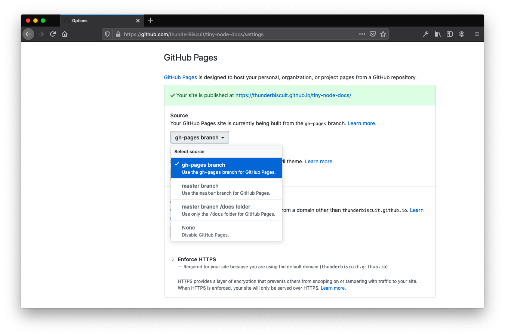

This article lays out the initial setup needed to leverage a static site generator and build a full documentation website starting with only a set of markdown files. Small websites like these do not require any backend development, and can easily be hosted for free on GitHub, Netlify, and others. You can [check out the end result here](https://thunderbiscuit.github.io/tiny-node-docs/).

<center>
  <figure style="max-width: 600px; margin: 3rem 0;">
    <!-- <p style="font-family: 'Fira Code', monospace; font-size: 16px; font-weight: 600;">Landing Page<p> -->
    <div id="pale-img">
      
    </div>
    <p style="font-family: 'Fira Code', monospace; font-size: 11px; line-height: 20px; text-align: left !important;">From a few markdown pages to a full-fledged free-hosted website in an afternoon.<p>
  </figure>
</center>

These websites are perfect for small projects that require documentation but don't want to or cannot spend the resources necessary to write complex frontend and backend architectures. 

## What's in a name?

Static site generators (SSGs) have gained popularity over the past few years for very good reasons. Nowadays, they come in all sorts of flavours, and chances are you visited a dozen statically generated websites today alone (this blog is one of them!). You might know the names: _Gatsby_, _Jekyll_, _Hugo_, _Vuepress_, _Docsify_. The idea behind them is simple: 
1. choose a set of defaults, themes, routes, and pages
2. provide the "meat" of the pages in the form of, say, markdown files
3. let the generator build a site for you

They are called "static" site generators because the end result is a set of static files that are simply served upon request. There is no database that custom builds pages depending on specific client-side requests. The pages are all pre-built, ready to go. It makes them very fast, and imprevious to certain types of attacks (there is no database to get into, for example). It also makes them extremely easy to host, and in fact you can host most small to medium size static sites for free these days.

There are many types of SSGs, going from flexible and powerful ([Gatsby](https://www.gatsbyjs.org/)) to targeted but very easy to use ([VuePress](https://vuepress.vuejs.org/)). Documentation websites are prime candidates for really simple development and deployment; they really are just a bunch of markdown files we wish to serve in a pretty package to our users. This makes them great targets for specialized static site generators, one of which is VuePress.

Why are VuePress documentation sites so cool?

1. They completely frontload the work of developing the site. Once you've set them up, all you need to do is feed them markdown pages. This means your project can have a dedicated repository for the docs, and it's easy to allow for PRs to incorporate contributions from the community if you wish to do so
2. They come with heavy defaults that will allow you to launch quickly, yet are _very_ flexible. Dedicated frontend developers can have a field day molding the site to the project's specific needs if they want to
3. They can be hosted for free on GitHub Pages or Netlify

## VuePress

If you're looking to build a documentation website, you'll find there are plenty of options available. I invite you to research them ([GitBook](https://www.gitbook.com/), [Docsify](docsify.js.org/), [Docusaurus](https://docusaurus.io/), [Gatsby](https://www.gatsbyjs.org/)) and their associated tradeoffs. But VuePress is a static site generator that specializes in documentation websites, and I have found that it strikes a really good balance between ease-of-use, clean looking defaults, speed of deployment, and flexibility.

The goal of this article is not to make you a VuePress expert, but to showcase how easy it is to bring all of your markdown documentation files that are currently sitting scattered all over your repo(s!?)—yeah we've all been there—and transform them into a fully functional website in an afternoon. Make no mistake; to really get into the weeds you'll need to dig into the [VuePress documentation](https://vuepress.vuejs.org/). But to get the ball rolling, an afternoon of hard work is all you need.

In order to showcase the process from first commit to launch of website, I created a mock project in need of a documentation website: _tiny node_. Tiny node is not real, but the repo is there so you can see what I did and follow along. Tiny node is a project where the project is to make the documentation for the project...
meta enough for ya? [Check out the repo here](https://github.com/thunderBiscuit/tiny-node-docs). The proof is right in that pudding—the repo has 8 commits to it, and the website is live [here](https://thunderbiscuit.github.io/tiny-node-docs/).

## Get to it

Our basic plan for developing the website can be thought of as consisting of 3 main tasks:
1. Collect markdown files
2. Write a configuration file that will tell VuePress how to group our docs and generate the navbar and sidebar
3. Deploy that bad boy

Here's what our final repository will look like:

<center>
  <figure style="max-width: 600px; margin: 3rem 0;">
    <!-- <p style="font-family: 'Fira Code', monospace; font-size: 16px; font-weight: 600;">Landing Page<p> -->
      
    <!-- <p style="font-family: 'Fira Code', monospace; font-size: 11px; line-height: 20px; text-align: left !important;"><p> -->
  </figure>
</center>

It's all very simple. The repo has 1 directory, `/docs/`, which contains two things: 
1. a bunch of markdown files
2. a hidden `/.vuepress/` directory with all the info VuePress needs to build our website (structure, theme overrides, images)

Note that everything in a VuePress site is completely customizable, and frontend devs can use theme shadowing to override any component or style. But one of the strenghts of VuePress is its set of great defaults; even the most basic VuePress site will come out looking clean and ready to go. In this example we keep the UI and UX in line with VuePress' defaults, and so _all that's needed_ is a single `config.js` file to transform our docs into a full fledged website. 

Let's get to it.

<center>
  <figure style="max-width: 600px; margin: 3rem 0;">
    <p style="font-family: 'Fira Code', monospace; font-size: 16px; font-weight: 600;">Full Commit History<p>
      
    <p style="font-family: 'Fira Code', monospace; font-size: 11px; line-height: 20px; text-align: left !important;">The first 7 commits are made on the master branch. The 8th one is the deploy commit, made on a special deloyment branch called gh-pages.<p>
  </figure>
</center>

### commit 0 — `initial empty commit`

I like starting my repos with a blank commit. It's a neat little trick that makes rebasing easier if you need to in the future, and is just a clean way to start a repo. The command to get yourself one of these is `git commit --allow-empty -m "initial empty commit"`.

We're also going to create another branch which we'll need later called `gh-pages`. Start by going to GitHub and creating an empty repository, then clone that repo locally.

```shell
# in your shell:

# clone empty repo and get in there
$ git clone https://github.com/<my-username>/<myrepo>.git
$ cd myrepo

# create initial empty commit
$ git commit --allow-empty -m "initial empty commit"
$ git push

# create second branch and push to remote
$ git switch --create gh-pages
$ git push -u origin gh-pages
```

At this point the remote should have two branches, each with the same initial empty commit. We'll be on the `master` branch up until commit 7, so get back there if you need to (`git switch master`).

<br />

### commit 1 — `build: add gitignore`

We add two directories to the gitignore:

```shell
#  /.gitignore

node_modules
docs/.vuepress/dist/
```

The `/dist/` directory is the target directory for the final website. It is not part of the source code needed to build it, and is only used when we build the site and push it to the special branch that GitHub or Netlify will use to upload and serve.

<br />

### commit 2 — `build: add vuepress as a dependency`
The only dependency for this project is VuePress! Easy as pie. The version at the time of this writing is `v1.4.0`.

```python
# in your shell: 

$ yarn add vuepress
```

This is where you'll commit your `/package.json` and `/yarn.lock` files. Your `package.json` file should have been created automatically by yarn and should look like this:

```json
//  /package.json

{
  "dependencies": {
    "vuepress": "^1.4.0"
  }
}
```

<br />

### commit 3 — `docs: add readme`

Add a README to your repository, with some basic info on how to access the docs, and maybe how to deploy the site locally for contributors.

<br />

### commit 4 — `docs: add config file + website MVP`

This is where things get interesting. The `/docs/.vuepress/config.js` file is the heart of a VuePress site; it's where everything comes together—the bridge between your markdown files and the site generator.

With this commit, we're not trying to build the whole site just yet, but simply a minumum viable product—a single page with a navbar.

```js
//  /docs/.vuepress/config.js

module.exports = {
  title: "Tiny Node Docs",
  description: "Documentation website for tiny node",
  base: "/tiny-node-docs/",
  themeConfig: {
    navbar: true,
    nav: [
      { text: "GitHub", link: "https://github.com/thunderBiscuit/tiny-node-docs"},
      { text: "Website", link: "https://www.thunderbiscuit.com/"}
    ],
  }
}
```

```js
//  /docs/README.md

# Tiny Node Documentation
```

Notice that we have created a second README file. Do not confuse it with the README at the root of the repository. This one lives inside the `/docs/` directory, and defines the landing page for the website.

Once those are in place, we're ready to fire up the website locally in development mode. In your shell, type `vuepress dev docs`, and VuePress will build a site for you, which you'll be able to access at [`http://localhost:8080/tiny-node-docs/`](http://localhost:8080/tiny-node-docs/).

<center>
  <figure style="max-width: 600px; margin: 3rem 0;">
    <p style="font-family: 'Fira Code', monospace; font-size: 16px; font-weight: 600;">Our Website MVP<p>
    <div id="pale-img">
      
    </div>
    <!-- <p style="font-family: 'Fira Code', monospace; font-size: 11px; line-height: 20px; text-align: left !important;">From a few markdown pages to a full-fledged free-hosted website in an afternoon.<p> -->
  </figure>
</center>

<br />

### commit 5 — `docs: add logo + first documentation pages`

This is a fun one. We're bringing in the markdown files, adding a logo, and expanding the `config.js` file to create a proper sidebar. Bam! Our website is fully working on our local server.

We put images in the `/docs/.vuepress/public/images/` directory. My example site has one image (the logo) and I use it on the landing page by adding this html tag to my markdown: ``. Note the `src`. Anything you put in the `public` folder will be accessible throughout your website in this manner.

The next part of this commit consists of building the `config.js` file. Many options are available, and you should consult the VuePress documentation for more granular examples and flexibility. My config file looks like this:

```javascript
module.exports = {
  title: "Tiny Node Docs",
  description: "Documentation website for tiny node",
  base: "/tiny-node-docs/",
  themeConfig: {
    navbar: true,
    nav: [
      { text: "GitHub", link: "https://github.com/thunderBiscuit/tiny-node-docs"},
      { text: "Website", link: "https://www.thunderbiscuit.com/"}
    ],
    logo: "/images/logo.png",
    sidebarDepth: 0,
    sidebar: [
      {
        collapsable: false,
        title: "Getting Started",
        children: [
          ["/intro/introduction", 'Introduction'],
          ["/intro/getting-started", 'Getting Started'],
        ]
      },
      {
        collapsable: true,
        title: "Bitcoin",
        children: [
          ["/bitcoin/running-lightning", 'Running Lightning'],
          ["/bitcoin/troubleshooting", 'Troubleshooting'],
        ]
      },
      {
        collapsable: true,
        title: "Remote Access",
        children: [
          ["/remote-access/connect-tor", 'Connect Via Tor'],
        ]
      },
    ]
  }
}
```

Sections of the sidebar can be collapsible or not, and are defined by giving them a title and enumerating their children. Children need a path as well as a name.

That's it! Our website is ready to go. Type in `vuepress dev docs` in your bash terminal and verify you are happy with the final product locally before deploying.

<br />

### commit 6 — `build: add deploy script`
Now that we've got a website we're happy with, we're ready to deploy it. This step will differ depending on your deployment platform, but we'll use the simplest one where you deploy a small static website for free on GitHub pages.

The workflow for this is a 2-step process:
1. use a deploy script to build the website locally and push it to a branch on your remote repo (it is common practice to name that branch `gh-pages`)
2. tell GitHub to monitor that branch for changes. GitHub will rebuild your website whenever a new commit is made to it

Our `deploy.sh` script looks like this:

```shell
#!/usr/bin/env sh

# abort on errors
set -e

# build
vuepress build docs

# navigate into the build output directory
cd docs/.vuepress/dist

git init
git add -A
git commit -m "deploy"

git push -f git@github.com:thunderBiscuit/tiny-node-docs.git master:gh-pages

cd -
```

The above script basically _(a)_ builds the website, _(b)_ creates a git repo out of it, and _(c)_, pushes it to the `gh-pages` branch. Note that to push using SSH like I do here, you'll need to set up SSH keys on your GitHub account.

Once we have written and committed our `deploy.sh`, we need to go on GitHub and activate GitHub pages, as well as tell it which branch of our repository to monitor for changes. This is done under the _Settings_ tab of your repository.

<center>
  <figure style="max-width: 600px; margin: 3rem 0;">
    <!-- <p style="font-family: 'Fira Code', monospace; font-size: 16px; font-weight: 600;">Landing Page<p> -->
      
    <!-- <p style="font-family: 'Fira Code', monospace; font-size: 11px; line-height: 20px; text-align: left !important;"><p> -->
  </figure>
</center>

<br />

### commit 7 — `build: deploy`

This is our final commit, the one where we deploy the website! All you need to do is run the `deploy.sh` script, which will take care of building and pushing newly minted site to the `gh-pages` branch. Github will automatically build your site within a few minutes.

```shell
$ source ./deploy.sh
```

That's it! 8 commits. 1 website. 1 more project with awesome docs.

## What Next?

If you've built and launched your website, it won't be long before you have needs that fall outside of the VuePress defaults. Take the time to explore their docs; you'll find that tons of interesting features can be built on top of the basic setup. Better search bar, separate landing page, and component shadowing are some ideas to start. You can also host on Netlify (for free) and buy a domain name (for a fee) if you don't want the project to be hosted directly on your personal GitHub repo pages.

If you build something cool, make sure to [let me know on twitter](https://twitter.com/thunderB__)!